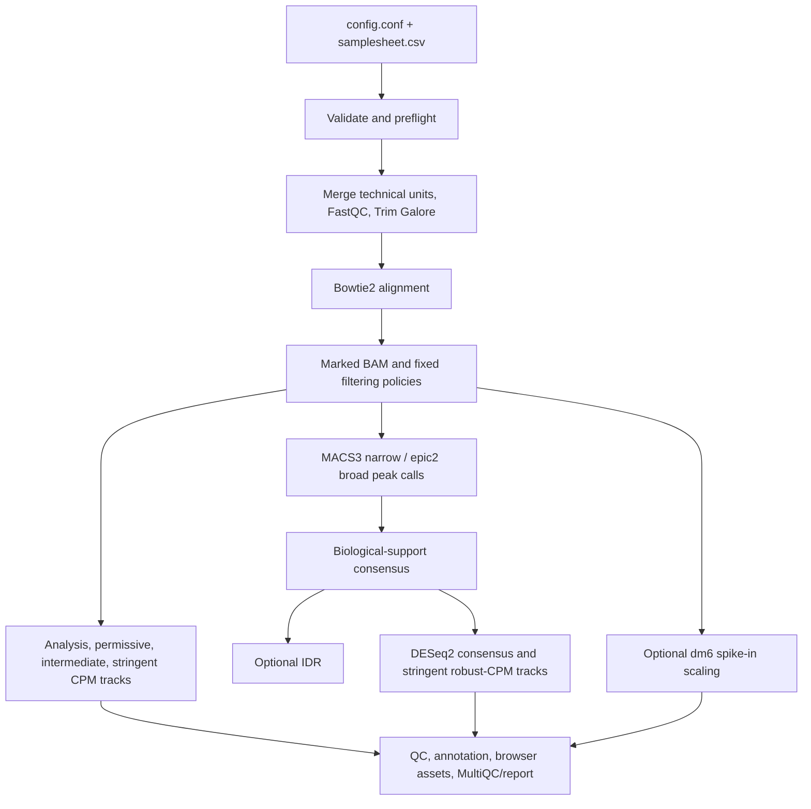

# chip2tracks

`chip2tracks` is a restartable, samplesheet-driven Bash workflow for two
explicit assay profiles: conventional ChIP-seq and ChIPmentation. Version 0.1.0
is derived from the local `cutnrun2tracks` 0.2.8 execution engine but removes
CUT&RUN/CUT&Tag-specific peak and fragment assumptions.

The workflow is under active validation. Do not use v0.1.0 pilot output as the
sole basis for publication or clinical decisions until it passes representative
local ChIP-seq and ChIPmentation datasets.

## Analysis contract

- `ASSAY_PROFILE=chipseq` or `ASSAY_PROFILE=chipmentation`; profiles cannot be
  mixed within one run.
- One samplesheet defines one compatible target/antibody and narrow-or-broad
  peak universe. Conditions, biological replicates, technical replicates, and
  compatible shared controls may coexist; different targets use separate runs.
- PE and SE libraries are supported. MACS3 uses real fragments with `BAMPE` for
  PE and its fragment model for SE unless a fixed extension is explicitly set.
  Coverage uses PE fragments; SE coverage defaults to a MACS3 `predictd`
  estimate with a recorded, configurable 200-bp fallback.
- Trim Galore auto-detection is the default for common Illumina/Nextera adapter
  families. The decision evidence is retained in
  `01_fastq_qc/adapter_detection.tsv`; explicit and custom overrides are
  available. A kit name is therefore not mandatory for common adapters, but it
  remains important provenance and is required when auto-detection is
  unresolved or the library uses custom/partial adapters.
- Matched input/IgG/mock controls are optional. When absent, outputs are marked
  as control-free and control-normalized biological interpretation is not
  implied. This permits exploratory/local datasets but does not override
  publication standards that expect matched input controls.
- MACS3 is the narrow-peak caller. epic2 is the preferred broad-domain caller,
  with MACS3 broad retained as a companion sensitivity analysis. epic2 is
  purpose-built for diffuse enrichment, but is not claimed to be universally
  best for every mark or dataset.
- Drosophila cell spike-in is supported through competitive host+dm6 alignment.
  Scale factors and warning thresholds are recorded. It is optional and off in
  the public template; enabling it requires the composite index and dm6 paths.
- Duplicate-retained and duplicate-removed branches are preserved. The analysis
  branch defaults to duplicate removal; library-complexity and cross-correlation
  QC always use the duplicate-retained q30 BAM so the metrics remain meaningful.
- The default reproducibility method is the `ATACseq2tracks`-style consensus:
  an interval must be supported by peaks from at least two distinct biological
  sample keys. It is used for counting, normalized tracks, QC, annotation, and
  differential analysis. Pairwise true-replicate IDR is supplementary and
  disabled by default (`RUN_IDR=false`). Full pooled/pseudoreplicate IDR is a
  documented v0.2 extension.
- UMI-aware processing is deliberately rejected in v0.1 rather than silently
  mishandled.

## Quick start

```bash
git clone https://github.com/MichalGd/chip2tracks.git
cd chip2tracks
cp config/config.conf.template config.conf
cp config/examples/chipseq_pe.csv samplesheet.csv
# Edit every path and reference value in both files.
bash chip2tracks.sh --config "$PWD/config.conf" --samplesheet "$PWD/samplesheet.csv" --plan
bash chip2tracks.sh --config "$PWD/config.conf" --samplesheet "$PWD/samplesheet.csv" --preflight-only
bash chip2tracks.sh --config "$PWD/config.conf" --samplesheet "$PWD/samplesheet.csv"
```

Reuse the server's installed tools first. Run the supplied read-only audit if
preflight reports missing software; create `environment.yml` only when the
server cannot provide a compatible main environment. `environment.epic2.yml`
is the broad-peak sidecar, while `environment.spp.yml` and
`environment.preseq.yml` isolate legacy QC dependencies from the modern main
environment. Optional IDR uses `environment.idr.yml`. These are installation
manifests, not additional per-analysis configuration files.

For a shared `/opt` deployment, install
`utilities/chip2tracks_shared_launcher.sh` as `/usr/local/bin/chip2tracks` and
`utilities/run_phantompeak_sidecar.sh` as `/usr/local/bin/run_spp.R`. The
launcher uses versioned system paths without activating Conda or modifying a
user's shell. Existing shared `epic2` and `preseq` executables can likewise be
exposed through `/usr/local/bin`.

Use `config/examples/chipmentation_pe.csv` for the second assay profile. Spike-in
is disabled by default. To enable the laboratory dm6 protocol, set
`SPIKEIN_MODE=dm6`, fill the reference settings, and populate all three
sample-sheet spike-in fields. To run without a control, leave `control_id`
empty; `ALLOW_CONTROL_FREE_PEAKCALL=true` is already the default.

## Stages and main outputs



1. Preflight validates metadata, tools, references, effective genome size, and
   the competitive spike-in index.
2. Preprocessing merges technical units, runs raw/trimmed FastQC, adapter-aware
   Trim Galore, and MultiQC.
3. Bowtie2 alignment and policy-specific filtering generate q0/q30,
   duplicate-retained/removed host BAMs.
4. CPM coverage, MACS3/epic2 peaks, control-relative MACS3 fold-enrichment
   tracks, spike-in tracks, and DESeq2 consensus-normalized tracks are created.
5. Consensus, optional IDR, NRF/PBC/preseq, fragment length, NSC/RSC, FRiP,
   fingerprints, Spearman correlation, PCA, differential analysis, annotation,
   browser files, and final reports are generated.

The stable top-level output groups are `00_metadata`, `01_fastq_qc`,
`02_trimmed_fastq`, `03_alignment`, `04_tracks`, `05_peaks`, `06_qc`,
`07_annotation`, `08_differential`, `09_browser`, and `10_reports`.

`09_browser/ucsc/` contains one-line UCSC custom-track descriptors for every
retained bigWig: one file per track family, `all_bigwig_tracks.txt` with groups
separated by ignored comment/blank lines, the backward-compatible `trackDb.txt`
copy, and a family manifest. A nonempty HTTP/HTTPS/FTP
`UCSC_BIGDATA_URL_BASE` is required for public UCSC to retrieve the bigWigs.

Restart with `--from-stage NAME`; stop a pilot with `--stop-after NAME`. The
named stage order is printed by `bash chip2tracks.sh --help`.

Large runs expose separate job limits for alignment/filtering, tracks, peak
calling, spike-in, and sample-level QC. Preflight records each maximum in
`00_metadata/resource_budget.tsv`; stage wall times are written to
`00_metadata/stage_timing.tsv`. See the configuration template before raising
limits on a shared server.

Priority coverage outputs are enabled in the template:

- `04_tracks/cpm/*.{CPM.bw,CPM.bedGraph}`: configured analysis-fragment/read CPM;
- `04_tracks/cpm/permissive/`: MAPQ 0, duplicates retained;
- `04_tracks/cpm/intermediate/`: MAPQ 0, duplicates removed;
- `04_tracks/cpm/stringent/`: MAPQ 30, duplicates removed;
- `04_tracks/deseq2_robust_cpm/stringent/`: stringent BAMs scaled by
  consensus-derived robust effective library sizes.

The formulas, comparison scope, filtering policy, spike-in scaling, and
control-relative fold-enrichment semantics for every family are documented in
[Genomic coverage tracks and normalization](docs/12_tracks_and_normalization.md).

`04_tracks/cpm/mapping_composition.tsv` reports, for every coverage policy,
the total signal observations, MAPQ 0 and MAPQ <30 observations, and Bowtie2
`XS`-tagged candidate multimappers. The same values apply to bedGraph and
bigWig files made from that policy because those formats are two
representations of the same filtered signal. The table is copied to
`10_reports/coverage_mapping_composition.tsv` and shown in both final reports.

Differential occupancy is summarized across all primary and sensitivity
variants in `10_reports/differential_occupancy_summary.tsv`. Disabled, skipped,
failed, and completed variants remain explicit, and completed rows link to the
full and significant result tables under `08_differential/`.

BigWig and uncompressed bedGraph retention are independently configurable with
`GENERATE_COVERAGE_BIGWIGS` and `GENERATE_COVERAGE_BEDGRAPHS` (both default to
`true`). Automatic cleanup defaults off so reruns retain their input
intermediates; opt-in cleanup records deletions and invalidates affected stage
checkpoints so a later full rerun rebuilds rather than silently reuses them.

## Deployment and provenance

Run the read-only server inventory before finalizing dependencies:

```bash
bash utilities/audit_server_environment.sh \
  --output "$PWD/chip2tracks_server_audit.txt" \
  --reference-root /opt/bioinformatics/references
```

See [docs/08_server_audit.md](docs/08_server_audit.md) for the full command.
The exact inherited local source is independently verifiable through
`provenance/cutnrun2tracks_v0.2.8.sha256` and
`provenance/SOURCE_BASELINE.md`.

MIT is used because it is short, permissive, broadly adopted, and convenient
for reuse in institutional and open-source environments. It does not remove the
obligation to cite upstream software or comply with their licenses.

## Documentation

- Start and operate: [configuration and samplesheet](docs/01_inputs_and_configuration.md),
  [pipeline stages](docs/07_pipeline_stages.md), and
  [outputs and recovery](docs/04_outputs_and_recovery.md).
- Understand the analysis: [methods](docs/02_methods.md),
  [references/blacklist/filtering](docs/10_references_blacklist_and_filtering.md),
  [quality control](docs/11_quality_control.md), and
  [tracks/normalization](docs/12_tracks_and_normalization.md).
- Design and interpret comparisons: [replicates and controls](docs/13_replicates_and_design.md),
  [differential occupancy](docs/14_differential_occupancy.md), and
  [annotation](docs/15_annotation.md).
- Validate deployment: [server audit](docs/08_server_audit.md),
  [limitations](docs/05_limitations.md), and the complete
  [documentation index](docs/README.md).

## License

[MIT](LICENSE)
